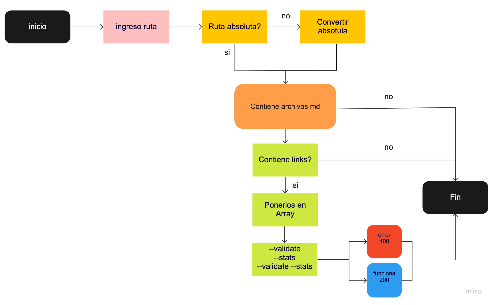

# [-md-links](https://www.npmjs.com/package/-md-links)

Es una librería que lee y analiza en formato Markdown, permite validar URL o links entregándonos información y sus estados, ejemplo(404, Not Found).

## Instalación

```sh
amr-md-links archivo.md
```

## ¿Cómo usar?

### En la terminal

Instalada la librería deberas escribir en la terminal, el comando junto al archivo.

`-md-links <archivo.md> [option]`

## CLI (Command Line Interface)

### Ejecución a través de la terminal:

`md-links <archivo.md> [option]`


Se obtiene como resultado:

- text: descripción del link.
- href: link encontrado
- path: archivo o ruta donde fue encontrado el link.
- line: linea donde fue encontrado el link.

## Options

### --validate

Entrega la validacion o status de los links (status: 200, ok, 404,fail, etc). Por ejemplo:

`md-links <archivo.md> --validate`


## Documentación técnica

### Dependencias:

- node.js versión v14.18.0
- node-fetch: "^3.1.0"
- jest: "^27.4.5"

## Planificación:

- Diagrama de Flujo en Miro.




## Autor
### Aylin Zuñiga